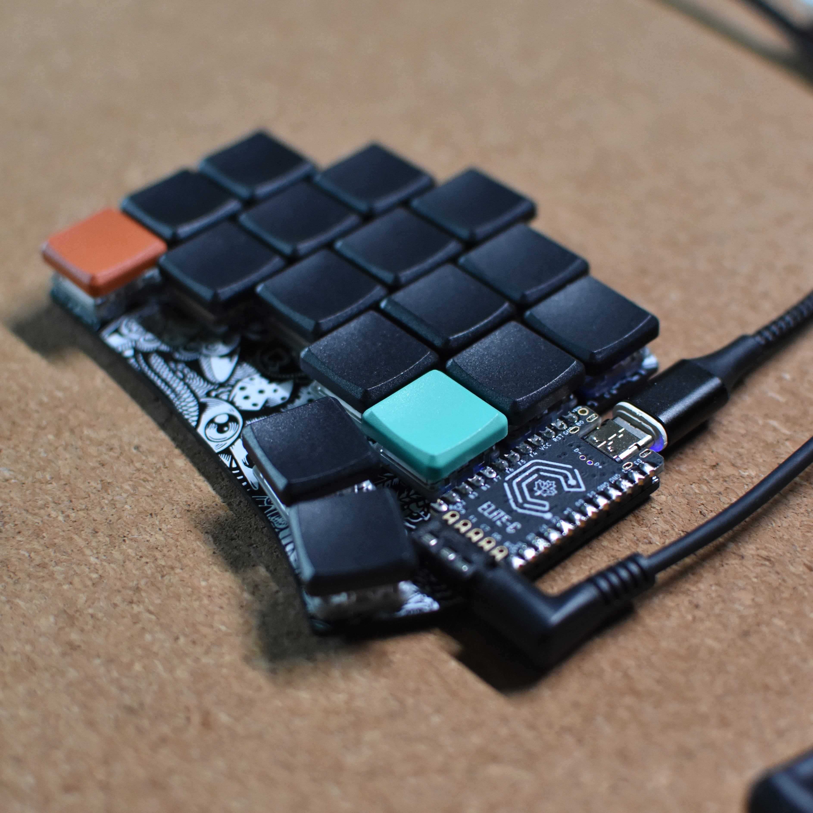
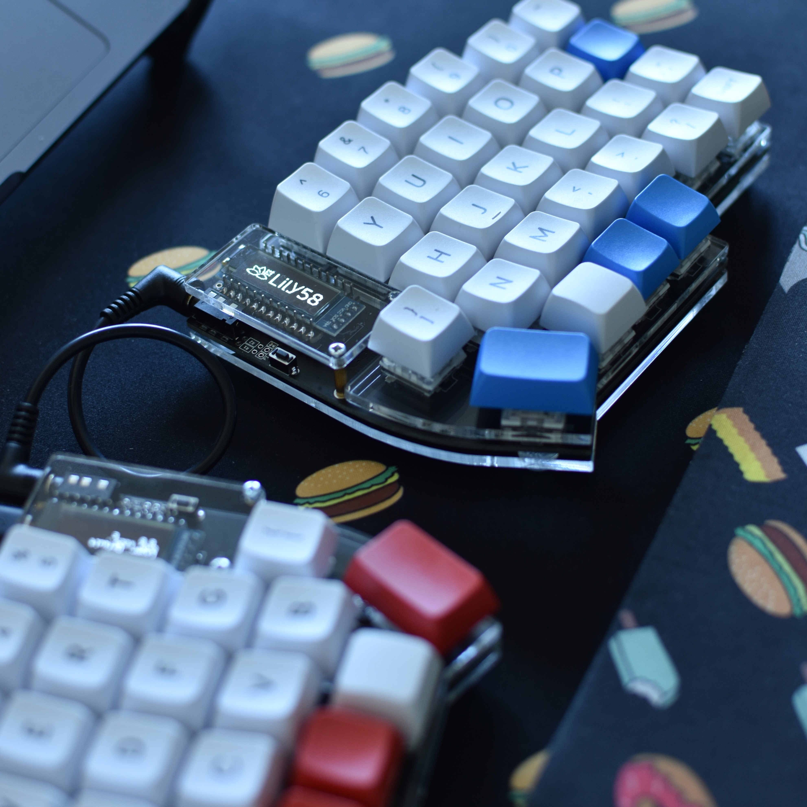

# keymaps
A user repository with my keymaps for QMK keyboards.

> [!NOTE]
> This repository is deprecated in favor for: https://github.com/patrick-elmquist/qmk_userspace

I posted a guide for how to set this up: [Post@Medium](https://medium.com/@patrick.elmquist/separate-keymap-repo-for-qmk-136ff5a419bd)

Keyboards:
- DASBOB / Choc Nocturnal (no image)
- Totem / Choc Pink (no image)
- Ferris Sweep / Choc Purpz
- Ferris Sweep / Choc Pink
- Ferris Sweep / Choc Pro Red (spring swapped to 15g)
- Kyria / Gateron Yellow
- Lily58 / Boba U4 Silent

